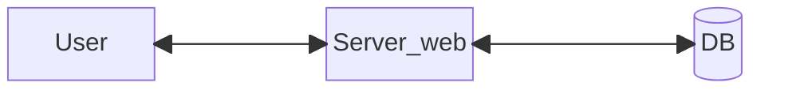
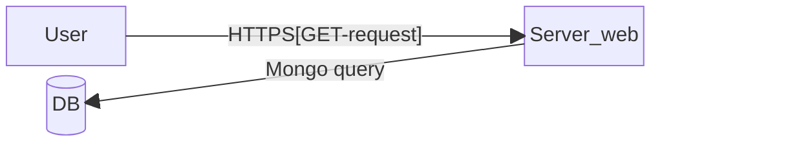
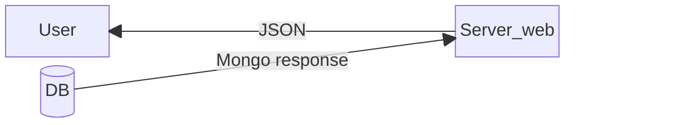
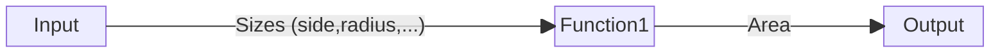
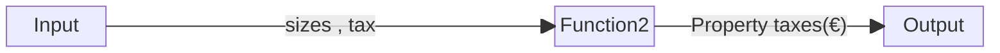
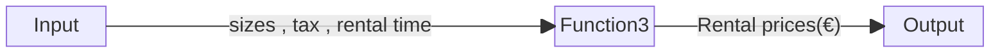
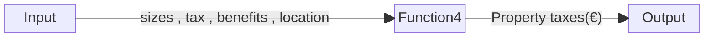

# 2.General description

## 2.1 Product perspective

### 2.1.1 System interface


### 2.1.2 User interface
The user can access the information(rental price,taxes,size,...) using a Site web.

### 2.1.3 Hardware interface
[*No hardware needed*]

### 2.1.4 Software interface
*Example of API JSON response*

``` json
{
  "codice": "MO+40-70",
  "utilizzo": "Agricolo",
  "lato": 32.04,
  "proprietario": "RSSMRA75A01F205Z"
}
```

### 2.1.5 Communication interface
These are the main protocols uses:

*REQUEST*


*RESPONSE*


### 2.1.6 Memory requirements
[*No memory requirements*]

## 2.2 Product functions
The product has *4* main functions:

### 1. Area calculator



### 2. Property tax calculator



### 3. Rental price calculator



### 4. Property value




## 2.3 User characteristics

The system interface will allow any non-specialized person to use the software.  
It is only required *1hour* beginner-course at the following link [Beginner tutorial](https://fake_link).

