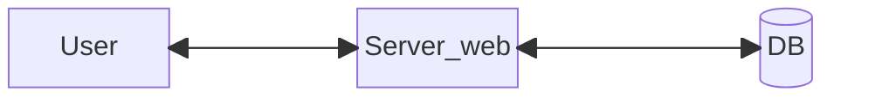
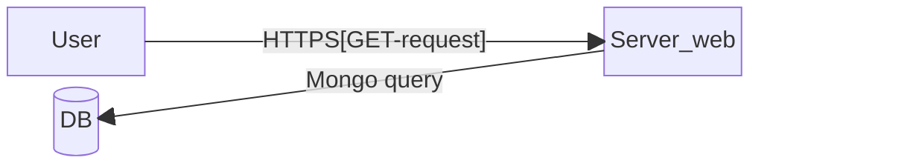
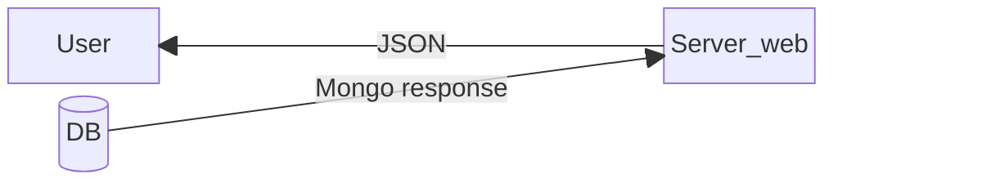
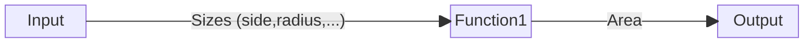
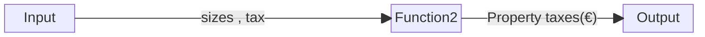
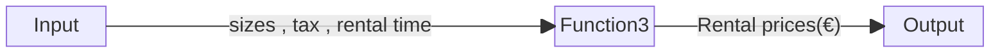
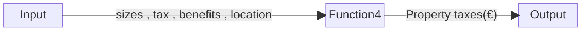

# Introduction

## 1.1 Purpose of document

This document serves to outline the requirements for the development of a web-based service responsible for calculating the area of rectangular land parcels within Region X.

## 1.2 Scope of the document

- **Product Name:** The software solution is titled "Land Parcel Calculation Service."
- **Goals:** The primary goal is to develop a web-based service that accurately calculates the area of rectangular land parcels within Region X in response to user requests.
- **Benefits:** The software will streamline the process of land parcel area calculation, providing valuable insights for various purposes such as tax assessment, land valuation, and urban planning.
- **What we could do in the future:** There is potential to extend the service to include mobile application functionality (IOS and Android), allowing users to access the land parcel calculation service conveniently from their mobile devices.  
  Additionally, there is a possibility of expanding the service to be available to all citizens, with appropriate data obfuscation measures implemented to prevent the leakage of sensitive information. This expansion would require careful consideration of privacy and security measures as well as an authentication sysyem.

## 1.3 Definitions, Acronyms and abbreviations

- SRS: Software Requirement Specifications
- JSON: JavaScript Object Notation
- CF: Codice Fiscale (Italian tax code)
- PIVA: Partita IVA (Italian VAT identification number)
- PDF: Portable Document Format
  (To be updated if any references are incorporated into the document in the future.)

## 1.4 References

(References, if any, will be included in the document appendix for further reading and citation.)

# 2.General description

## 2.1 Product perspective

### 2.1.1 System interface



### 2.1.2 User interface

The user can access the information(rental price,taxes,size,...) using a Site web.

### 2.1.3 Hardware interface

[*No hardware needed*]

### 2.1.4 Software interface

*Example of API JSON response:*

``` json
{
  "codice": "MO+40-70",
  "utilizzo": "Agricolo",
  "lato": 32.04,
  "proprietario": "RSSMRA75A01F205Z"
}
```

### 2.1.5 Communication interface

These are the main protocols uses:

*REQUEST:*



*RESPONSE:*



### 2.1.6 Memory requirements

[*No memory requirements*]

## 2.2 Product functions

The product has *4* main functions:

### 1. Area calculator



### 2. Property tax calculator



### 3. Rental price calculator



### 4. Property value




## 2.3 User characteristics

The system interface will allow any non-specialized person to use the software.  
It is only required *1hour* beginner-course at the following link [Beginner tutorial](https://fake_link).

## 2.4 General constraints

- The system must be developed using Java as the primary programming language.
- The database must be accessed using MongoDB.
- The system must be accessible on Windows, Linux, as well as through smartphones.
- The maximum response time for application requests is 5 seconds, while the maximum downtime is 1 minute.

## 2.5 Assumptions and dependencies

- The lands are already registered in the system.
- Tax calculation is based on land use type.
- Sensitive information such as the tax code must be obscured for unauthorized users.
- The availability of the service depends on the server's stability.
- The correct execution of the application depends on the proper implementation of interfaces with the MongoDB database.

## 2.6 Apportioning of requirements

....

